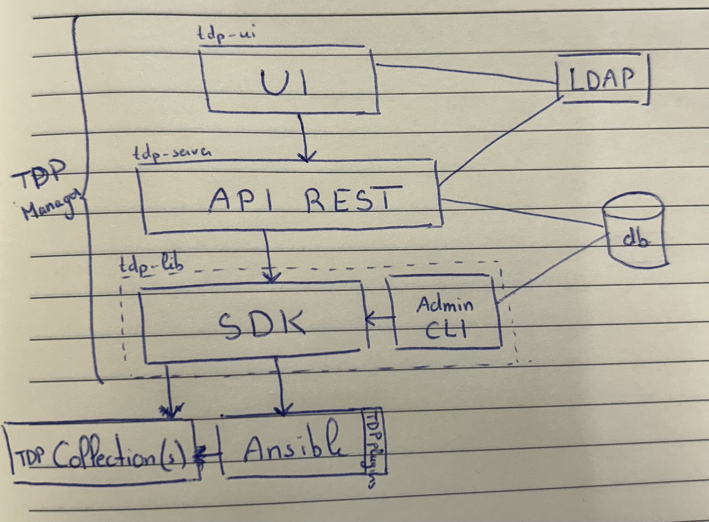

# TDP Manager

TDP Manager est un orchestrateur basé sur [Ansible](https://www.ansible.com/) permettant de déployer la stack TDP.

## Architecture

TDP Manager est composé de la manière suivante :

- `tdp-lib`, un SDK qui expose des objets qui permettent de planifier, exécuter (via [Ansible](https://www.ansible.com/)) et monitorer des déploiements basés sur un [DAG](https://fr.wikipedia.org/wiki/Graphe_orient%C3%A9_acyclique).
- `tdp-server`, un serveur web fournissant une API REST au dessus de `tdp-lib`. Il ajoute une couche d'authentification des utilisateurs.
- `tdp-ui`, une interface web reprenant les fonctionnalités de `tdp-server` et `tdp-lib`.

Une base de données relationnelle partagée entre `tdp-lib` et `tdp-server` est utilisée pour stocker les métadonnées liées aux déploiements.

`tdp-server` et `tdp-ui` peuvent être reliés à un fournisseur OpenID Connect pour Authentifier les utilisateurs.

<TODO>
Mettre le schema au propre. À changer :
  - "LDAP" -> OIDC Provider
  - Retirer "TDP Plugins" (ils font parti des collections)
</TODO>



Note : Chaque module de TDP manager est conçut de façon à abstraire les couches inférieures. Par exemple, la CLI d'administration (`tdp-lib`) peut être utilisé seule, `tdp-server` peut être utilisé sans `tdp-ui`, etc.

## Prérequis

Les prérequis pour installer TDP Manager sont les suivants :

- Avoir configuré l'environnement TDP : [Installation de l'environnement TDP](../environnement.md)
- Avoir installé les prérequis sur les hôtes : [Préparation des hôtes](../hotes-prep.md)

## Création de l'environnement

La création d'un environnement virtuel est recommandée. Par exemple en utilisant [`venv`](https://docs.python.org/3/library/venv.html):

```bash
# Création et activation d'un environnement virtuel (facultatif)
python3 -m venv .venv
source .venv/bin/activate
# Mise à jour de pip
pip install --upgrade pip
# Installation des dépendances
pip install --upgrade setuptools wheel
```

### Configuration d'Ansible

`tdp-lib` utilise la commande `ansible-playbook` pour exécuter les playbooks. Celle-ci doit pouvoir être appelée sans option et sans interaction de l'utilisateur. Pour cela, il est nécessaire de modifier le fichier `ansible.cfg` avec la propriété suivante :

```ini
[defaults]
any_errors_fatal=True ; RECOMMANDE permet d'arrêter l'exécution d'Ansible dès qu'il y a une erreur et empêche Ansible de continuer sur les hôtes restants.
; ... Autres propriétés
```

## Installation de la CLI d'administration

L'installation de `tdp-lib` peut être réalisée via `pip` :

```bash
# Chargement de l'environnement virtuel (facultatif)
source .venv/bin/activate
# Installation de tdp-lib et de la CLI
echo "tdp-lib[visualization]@https://github.com/TOSIT-IO/tdp-lib/tarball/master" > requirements.txt
pip install -r requirements.txt
```

### Configuration

La plupart des options passées à la CLI peuvent être configurées via des variables d'environnement. Il est conseillé de définir dans un fichier `.env` à la racine du projet les variables couramment utilisées:

- `TDP_COLLECTION_PATH`, liste de chemins vers les collections, séparés par le séparateur de chemin du système d'exploitation (vérifiable grâce à la commande `python -c "import os; print(os.pathsep)"`).
- `TDP_RUN_DIRECTORY`, le répertoire dans lequel les commandes Ansible seront exécutées (doit contenir le fichier `ansible.cfg`).
- `TDP_VARS`, le répertoire contenant les variables du cluster. Il peut être vide si l'initialisation est réalisée via la CLI.
- `TDP_DATABASE_DSN`, adresse de la base de données à utiliser.

### Initialisation

La CLI repose sur:

- Une base de données relationnelle qui stocke les métadonnées liées aux déploiements.
- Un dossier qui centralise les configurations des différents services (`tdp_vars`).

Ces deux éléments sont initialisés via la commande:

```bash
# Initialisation de la base de données et du dossier tdp_vars
tdp init
```

L'initialisation du dossier `tdp_vars` résulte de la concaténation des dossiers `tdp_vars_default` définies dans chaque collection ainsi que de l'ensemble des dossiers fournis via l'option `--overrides`.

### Utilisation

Se référer à la documentation de la CLI : [CLI](#).

## Installation de TDP Server

<TODO />

### Utilisation

Se référer à la documentation de TDP Server : [TDP Server](#).

## Installation de TDP UI

<TODO />

### Utilisation

Se référer à la documentation de TDP UI : [TDP UI](#).
